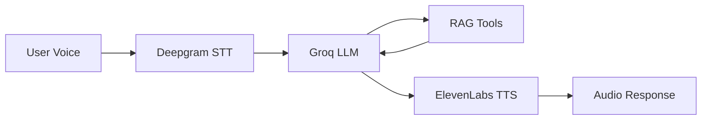

# Loop AI - Voice-Enabled Hospital Network Assistant

A conversational AI assistant that helps users find hospitals in their insurance network using voice commands. Built with Spring Boot, LangChain4j, and modern web technologies.

## Architecture



| Component | Technology | Purpose |
|-----------|------------|---------|
| STT | Deepgram Nova-3 | Speech-to-Text |
| LLM | Groq (Llama 3.3 70B) | Fast AI responses |
| RAG | LangChain4j + CSV | Hospital database search |
| TTS | ElevenLabs Turbo v2.5 | Text-to-Speech |
| Auth | Google OAuth 2.0 | User authentication |
| Forwarding | Twilio | Human agent escalation |

## Project Structure

```
LOOP/
├── loop-ai-backend/          # Spring Boot backend
│   ├── src/main/java/
│   │   └── com/loopai/backend/
│   │       ├── controller/   # REST endpoints
│   │       ├── service/      # Business logic
│   │       ├── config/       # Security, CORS
│   │       └── model/        # Data models
│   └── src/main/resources/
│       ├── data/             # Hospital CSV
│       └── application.properties.example
│
└── loop-ai-frontend/         # Static HTML/CSS/JS
    ├── index.html            # Login page
    └── home.html             # Voice chat interface
```
